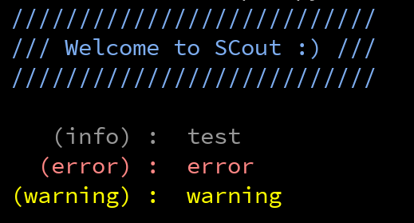

# SCout - Standard Character Out
Small python 3 library to print uniformly formatted console output tagged as

* info,
* warning,
* error or
* header.

If your console supports it coloured output will be used

# Usage
Similar to `print()`:

```python3
import SCout

SCout.header("Welcome to SCout :)")
SCout.info("Test text")
SCout.error("Error text")
SCout.warning("Warning text")
```

Example output:

<div align="left">

</div>
